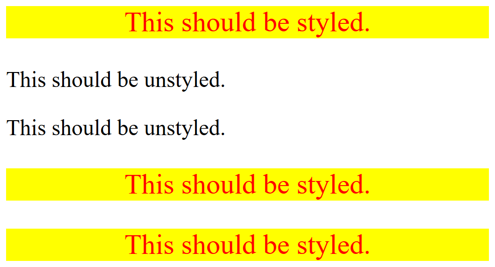

# Intro To CSS

Exercises consisting of a series of CSS-related tasks.

- Completed as part of the **CSS Foundations** section of the **Foundation Course** at [TheOdinProject](https://www.theodinproject.com).
- Taken from  the specified **css-exercises** repo; specifically the folder pertaining to [intro-to-css](https://github.com/TheOdinProject/css-exercises/tree/main/foundations/intro-to-css)

---

## Assignment Instructions

 -  [01 - CSS Methods &rArr;](./01-css-methods/)
 - [02 - Class ID Selectors &rArr;](./02-class-id-selectors/)
 - [03 - Grouping Selectors &rArr;](./03-grouping-selectors/)
 - [04 - Chaining Selectors &rArr;](./04-chaining-selectors/)
 - [05 - Descendant Combinator &rArr;](./05-descendant-combinator/)

## Results

<table>

<tr>
<td width="47%">

### 01 - CSS Methods

</td>
<td width="6%"></td>
<td width="47%"></td>
</tr>

<tr>
<td>

#### UNSTYLED

</td>
<td></td>
<td>

#### STYLED

</td>
</tr>

<tr>
<td>

</td>
<td align="center">
<h1>&rArr;</h1>
</td>
<td>

</td>
</tr>

<tr>
<td>

### 02 - Class ID Selectors

</td>
<td></td>
<td></td>
</tr>

<tr>
<td>

#### UNSTYLED

</td>
<td></td>
<td>

#### STYLED

</td>
</tr>

<tr>
<td>

</td>
<td align="center">
<h1>&rArr;</h1>
</td>
<td>

</td>
</tr>

<tr>
<td>

### 03 - Grouping Selectors

</td>
<td></td>
<td></td>
</tr>

<tr>
<td>

#### UNSTYLED

</td>
<td></td>
<td>

#### STYLED

</td>
</tr>

<tr>
<td>

</td>
<td align="center">
<h1>&rArr;</h1>
</td>
<td>

</td>
</tr>

<tr>
<td>

### 04 - Chaining Selectors

</td>
<td></td>
<td></td>
</tr>

<tr>
<td>

#### UNSTYLED

</td>
<td></td>
<td>

#### STYLED

</td>
</tr>

<tr>
<td>

</td>
<td align="center">
<h1>&rArr;</h1>
</td>
<td>

</td>
</tr>

<tr>
<td>

### 05 - Descendant Combinator

</td>
<td></td>
<td></td>
</tr>

<tr>
<td>

#### UNSTYLED

</td>
<td></td>
<td>

#### STYLED

</td>
</tr>

<tr>
<td>

</td>
<td align="center">
<h1>&rArr;</h1>
</td>
<td>

</td>
</tr>

</table>
